<div align="center">

<!-- hero: monochrome ASCII portrait (types in). regenerate:
     python scripts/prep_photo.py me.jpeg &&
     ASCII_HOST=chandan@github ASCII_NAME="Chandan Kumar" python scripts/make_ascii_svg.py -->

<h3><code>chandan@github ~ $ ./portrait.sh</code></h3>



<br>
<br>

</div>

## `$ whoami`

```yaml
name        : Chandan Kumar
alias       : MrTONYCHAN
role        : Full Stack Developer  ·  AI-Driven Engineer
location    : India 🇮🇳
focus       : Scalable Systems · Agentic AI · Cross-Platform Apps
status      : Building the future, one commit at a time 🚀
open_to     : Collaborations on React · .NET · AI/LLM integrations
```

---

<table>
<tr>
<td width="55%" valign="top">

### 🖥️ Current Status

```bash
$ cat current.log

[✓] Role      → Full Stack + AI-Driven Developer
[✓] Building  → Scalable systems & clean architecture
[✓] Web       → React · Next.js · Astro
[✓] Mobile    → Flutter · Android Native · Swift iOS
[✓] AI/LLM   → Agentic AI · LLM integrations
[~] Learning  → AWS Cloud Arch · Docker · DevOps
[⚡] Open to   → AI product collabs & open source
[?] Ask me    → Python · JS/TS · C# · System Design
[☕] Fuel      → Coffee (unlimited ♾️)
[🐛] Bugs     → They gave up. I didn't.
```

</td>
<td width="45%" valign="center">


</td>
</tr>
</table>

---

## `$ ls -la tech-stack/`

### ⚙️ Languages

<div align="center">


</div>

### 🌐 Web Frontend

<div align="center">


</div>

### 📱 Mobile

<div align="center">


</div>

### 🤖 AI / LLM Stack

<div align="center">


</div>

### 🔧 Backend & Cloud

<div align="center">


</div>

### 🛠️ Tools & Platforms

<div align="center">


</div>

---

## `$ cat github-stats.json`

<div align="center">


</div>

<div align="center">


</div>

---

## `$ git log --oneline --achievements`

<div align="center">


</div>

<br/>

<div align="center">

<a href="https://github.com/ryo-ma/github-profile-trophy">
  
</a>

</div>

<br/>

<div align="center">

<svg width="100%" height="120" viewBox="0 0 800 120" xmlns="http://www.w3.org/2000/svg">
  <defs>
    <linearGradient id="grad" x1="0%" y1="0%" x2="100%" y2="0%">
      <stop offset="0%" stop-color="#F52C67"/>
      <stop offset="50%" stop-color="#A020F0"/>
      <stop offset="100%" stop-color="#F52C67"/>
      <animate attributeName="x1" values="0%;100%;0%" dur="6s" repeatCount="indefinite"/>
    </linearGradient>
    <filter id="glow">
      <feGaussianBlur stdDeviation="3" result="blur"/>
      <feMerge>
        <feMergeNode in="blur"/>
        <feMergeNode in="SourceGraphic"/>
      </feMerge>
    </filter>
  </defs>
  <rect x="2" y="2" width="796" height="116" rx="12" fill="none" stroke="url(#grad)" stroke-width="2" filter="url(#glow)">
    <animate attributeName="stroke-dasharray" values="0,1900;1900,0" dur="4s" repeatCount="indefinite"/>
  </rect>
  <text x="400" y="50" text-anchor="middle" fill="#F52C67" font-family="Fira Code, monospace" font-weight="700" font-size="22" filter="url(#glow)">
    ◆ HALL OF FAME ◆
    <animate attributeName="opacity" values="0.6;1;0.6" dur="2s" repeatCount="indefinite"/>
  </text>
  <text x="400" y="85" text-anchor="middle" fill="#FFFFFF" font-family="Fira Code, monospace" font-size="14" opacity="0.85">
    Full Stack · AI-Driven · Shipping at the speed of thought
  </text>
</svg>

</div>

<br/>

### 🏆 Achievement Unlocked

<div align="center">


</div>

### ⚡ Skill Mastery

<div align="center">

<a href="https://skillicons.dev">
  
</a>

</div>

<br/>

<div align="center">


</div>

---

## `$ cat activity-graph.svg`

<div align="center">

[](https://github.com/MrTONYCHAN)

</div>

---

## `$ ./snake-game.sh`

<div align="center">


</div>

---

## `$ ping --connect-with me`

<div align="center">

[](https://www.linkedin.com/in/chandan-kumar-a83987166/)
[](mailto:mrtonychan98@gmail.com)
[](https://github.com/MrTONYCHAN)

</div>

---

<div align="center">

```
╔══════════════════════════════════════════════════════════════╗
║  "Any sufficiently advanced technology is indistinguishable  ║
║   from magic."  — Arthur C. Clarke                          ║
║                                                              ║
║   > I build that magic. Let's ship something great._        ║
╚══════════════════════════════════════════════════════════════╝
```


</div>
