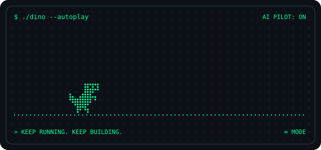

<div align="center">

<table>
<tr>
<td width="48%" valign="top" align="center">



</td>
<td width="52%" valign="top" align="left">

### `$ whoami`

```yaml
name        : Chandan Kumar
alias       : MrTONYCHAN
role        : Full Stack Developer · AI-Driven Engineer
location    : India 🇮🇳
focus       : Scalable Systems · Agentic AI · Cross-Platform Apps
status      : Building the future, one commit at a time 🚀
open_to     : Collaborations mode on
```



</td>
</tr>
</table>

<br>

</div>

<table>
<tr>
<td width="55%" valign="top">

### 🖥️ Current Status

```bash
$ cat current.log

[✓] Role      → Full Stack + AI-Driven Developer
[✓] Building  → Scalable systems & clean architecture
[✓] Web       → React · Next.js · Astro
[✓] Mobile    → Flutter · Android Native · Swift iOS
[✓] AI/LLM    → Agentic AI · LLM integrations
[~] Learning  → AWS Cloud Arch · Docker · DevOps
[⚡] Open to  → AI product collabs & open source
[?] Ask me    → Python · JS/TS · C# · System Design
[☕] Fuel     → Coffee (unlimited ♾️)
[🐛] Bugs     → They gave up. I didn't.
```

</td>
<td width="45%" valign="center">


</td>
</tr>
</table>

---

<div align="center">

```text
     ·   ●   ·   ·   ●   ·   ·   ●   ·   ·   ●   ·
     0   1   0   1   1   0   1   0   0   1   0   1
     ·   ░   ·   ▒   ·   ▓   ·   ▒   ·   ░   ·   ·

                [ CODE → CREATE → SHIP ]
```


<br>


```text
     ·   ·   ●   ·   ·   ●   ·   ·   ●   ·   ·   ●

                   > SYSTEM ONLINE █
```

</div>
